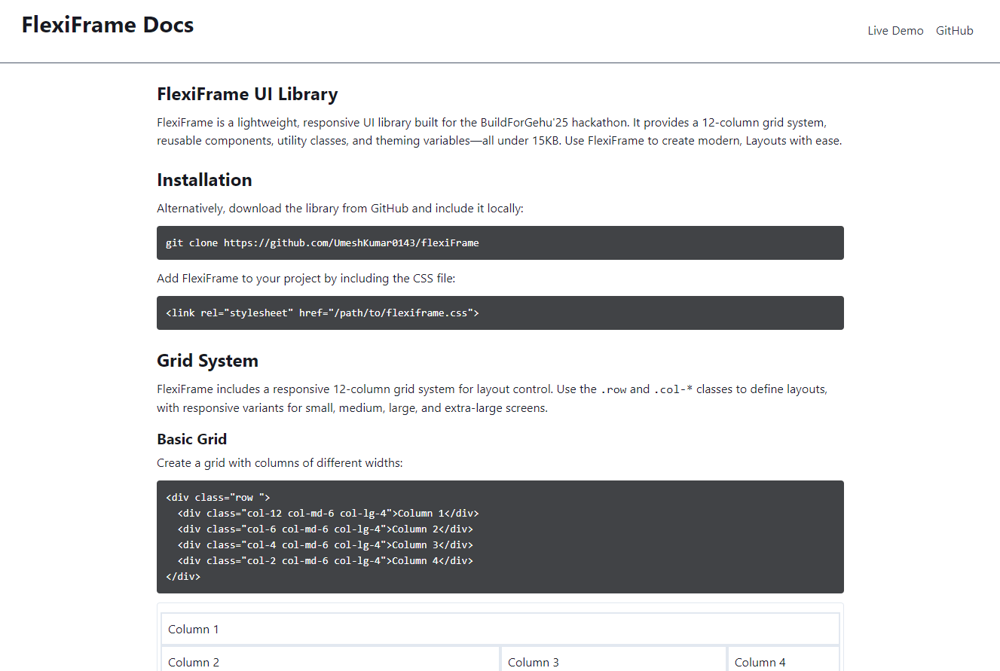
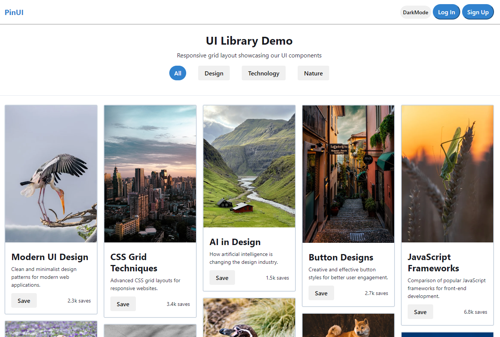
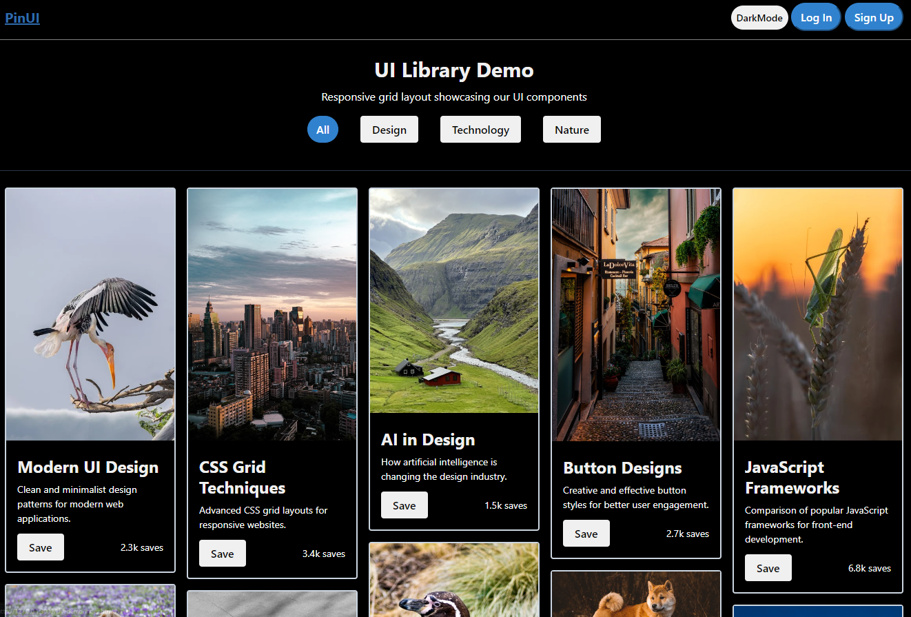
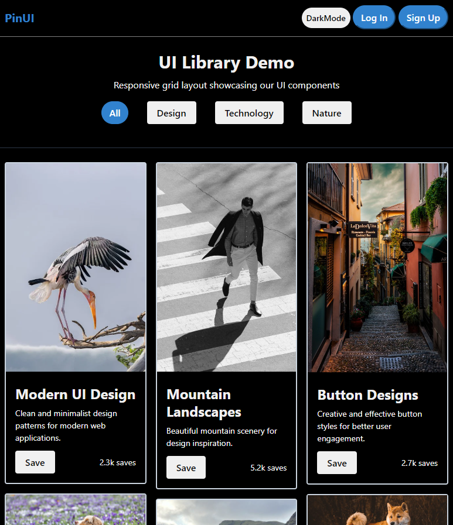

# 🌟 flexiFrame – A Custom UI Library for BuildForGehu'25

**Team Name**: HelloWorld!  
**Project Name**: flexiFrame  
**Event**: BuildForGehu'25  
**Contact**: ypandey700@gmail.com
Expand
message.txt
5 KB

# 🌟 flexiFrame – A Custom UI Library for BuildForGehu'25

**Team Name**: HelloWorld!  
**Project Name**: flexiFrame  
**Event**: BuildForGehu'25  
**Contact**: ypandey700@gmail.com

---

## 🚀 Introduction

**flexiFrame** is a lightweight, scalable, and developer-first UI library crafted to overcome the limitations of popular CSS frameworks like Bootstrap and Tailwind. Built for performance, clarity, and customization, it provides a balanced mix of utility classes and reusable UI components.

---

## 👥 Team Members

| Name               | Contribution                             |
|--------------------|------------------------------------------|
| **Yogesh Pandey**  | Responsive Grid Layout                   |
| **Umesh Kumar**    | Base Class & Live Demo                   |
| **Riya Garjola**   | Utilities and Layout                     |
| **Priyanshu Birkhani** | UI Components & Documentation Lead |

---


## ⚠️ Limitations of Popular Frameworks

| Limitation               | Bootstrap | Tailwind CSS | flexiFrame |
|--------------------------|-----------|--------------|------------|
| Limited Customization    | ✅        | ⚠️           | ✅ (Highly modular) |
| Overused Design Identity | ✅        | ❌           | ✅ (Original designs) |
| Code Bloat               | ✅        | ⚠️           | ✅ (Minimalist core) |
| Performance Issues       | ✅        | ⚠️           | ✅ (Optimized loading) |
| Over-reliance on Utilities| ❌       | ✅           | ✅ (Clean abstraction) |
| Limited Flexibility      | ✅        | ❌           | ✅ (Deep modification support) |
| Potential Overuse        | ❌        | ✅           | ✅ (Best-practice tools) |

---

## 💡 Why flexiFrame?

- 🎨 **Unique Visuals** without pre-opinionated styles.
- ⚖️ **Balanced Abstraction**: Utility-first + component-driven.
- 🧠 **Beginner-Friendly** syntax & reusable patterns.
- 💻 **Clean HTML** with shortcut tools.
- ♿ **Accessibility First**: ARIA & best practices integrated.

---

## 🔩 Framework Architecture

**Built With**:
- `HTML`, `CSS`, `JavaScript`
- Version Control: `GitHub`

**Structure Overview**:
- Grid System: 12-column, Flexbox-based responsive layout.
- Utility Classes: Spacing, Typography, Flex, and more.
- Components: Buttons, Forms, Cards, Navbars, Alerts, etc.
- Theming: CSS Variables with Dark Mode Support.

---

## 📐 Usage Guide

### ✅ Step-by-Step Integration

1. **Clone the Repo**  
   ```bash
   git clone https://github.com/UmeshKumar0143/flexiFrame
   ```

2. **Import the CSS**
   ```html
    <link rel="stylesheet" href="/flexiframe/flexiframe.css">
   ```

3. **Use Components**
   ```html
   <button class="btn-primary">Click Me</button>
   <div class="col-md-6 offset-lg-2">Responsive Grid</div>
   ```

4. **Customize Themes**
   Modify root CSS variables for branding or dark mode.

---

## 🛠️ Key Features

- 📱 **Mobile-first** & Responsive by Default
- 🌒 **Dark Mode Support**
- 🔧 **Extensible & Scalable Architecture**
- ♻️ **Reusable & Modular Components**
- 🧩 **Utility + Component Driven Design**

---
## 📸 Project Snapshots

Here are a few glimpses of **flexiFrame** in action:

### 📘 Documentation UI


### 🧱 Component: Buttons & Inputs


### 🌙 Dark Mode Preview


### 📱 Responsive Layout Demo



---

## 🔗 Live Demo & Repository

- **GitHub**: [flexiFrame on GitHub](https://github.com/UmeshKumar0143/flexiFrame)
- **Inspired By**:
  - [Bootstrap Docs](https://getbootstrap.com/docs/5.0/getting-started/introduction/)
  - [Tailwind CSS Docs](https://tailwindcss.com/docs/installation)

---

## 🧾 Conclusion

**flexiFrame** empowers developers with a UI framework that is modern, intuitive, and powerful. It eliminates common pitfalls like code bloat and rigidity found in traditional frameworks, and instead promotes clean, responsive, and accessible design — making web development **fast, fun, and futuristic**.

> _"Design is intelligence made visible — and flexiFrame is here to visualize yours!"_

---


